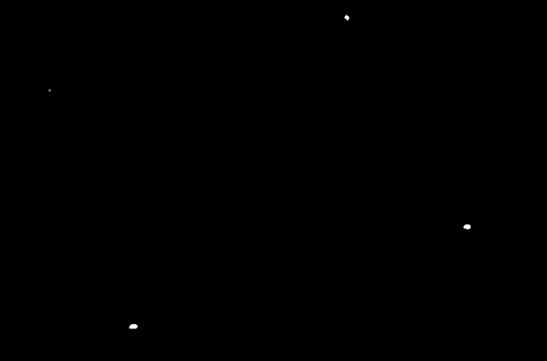
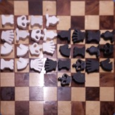
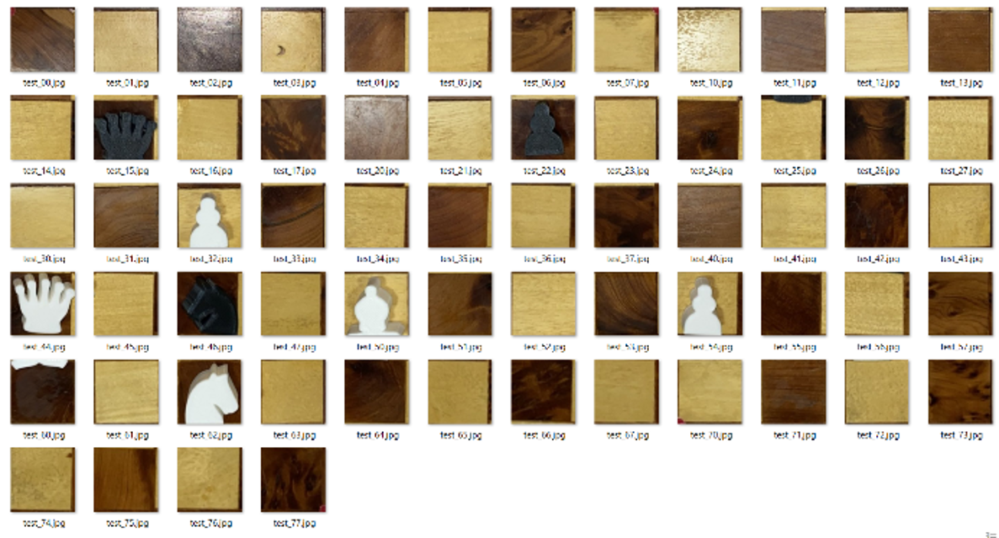
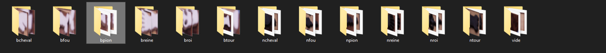
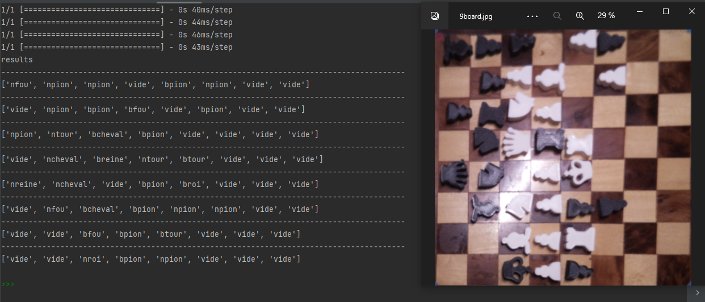
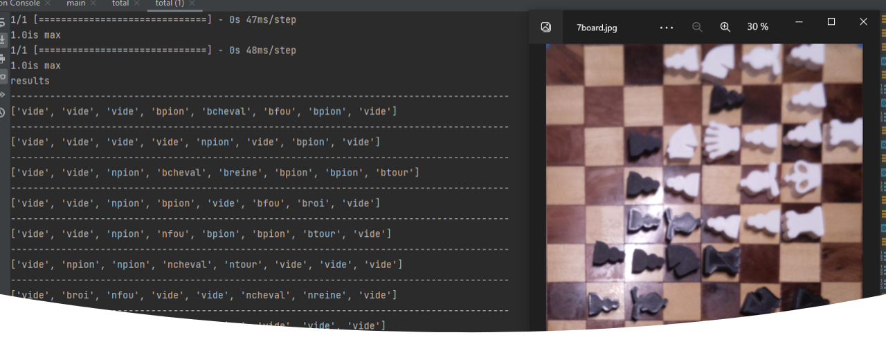

# Description
With my teammate [@Ghali](https://github.com/Ghali9)
for a computer vision course , we have to build a simple vision project. 

This project must use open CV and an IA .

We choose python to code this project and use TensorFlow to quickly integrate  an IA.

# steps 

1) we catch a picture of our chessborad and apply a HSV filter.

2) with the HSV picture we determine the mask to find the corners of the chessboard.

3) when we have corners we can use opencv to build a square picture of our chessboard.

4) after that we simply cut the pictures into 64 cases 

5) After prosessing a lot of picture we sort them into the dataset file .

6) we create a model 

7) we use the model to determine each case value . 

8) All picture are not working with a big accuracy ...

